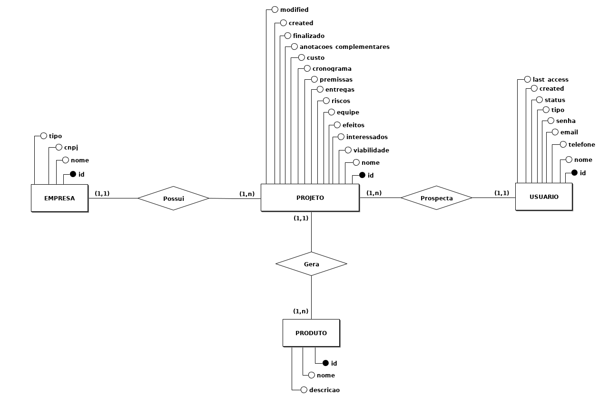
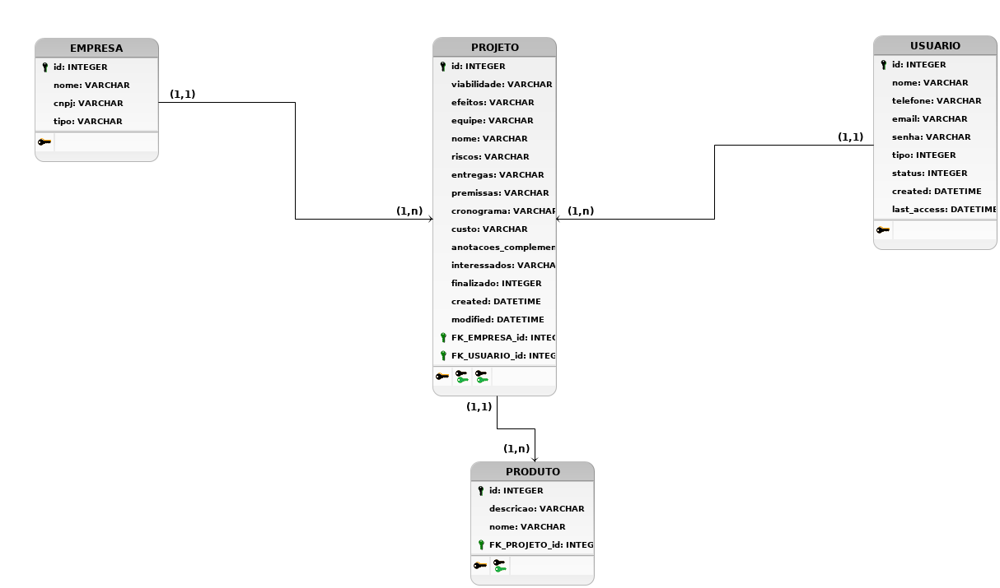

### Descrição: 
Criação de um sistema para prospecção de projetos no Polo de Inovação do IFES Campus Vitória.   

[Mockup do projeto](arquivos/Mockup_Prospeccao_Projetos.pdf)   

Pasta do Google Drive:

[Prospecção](https://drive.google.com/drive/folders/1CVqCn_gGK5CP8oXlqElxSrczc94dWwYH)   

### Modelo conceitual: 
   

### Modelo lógico: 
   