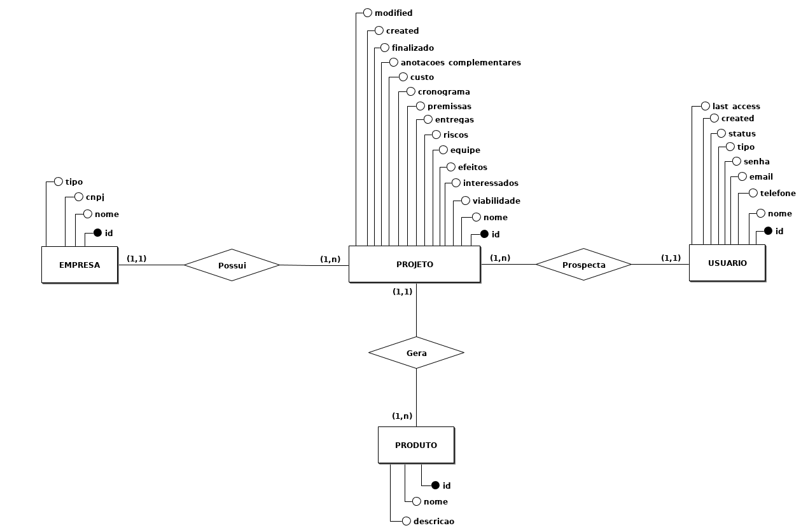
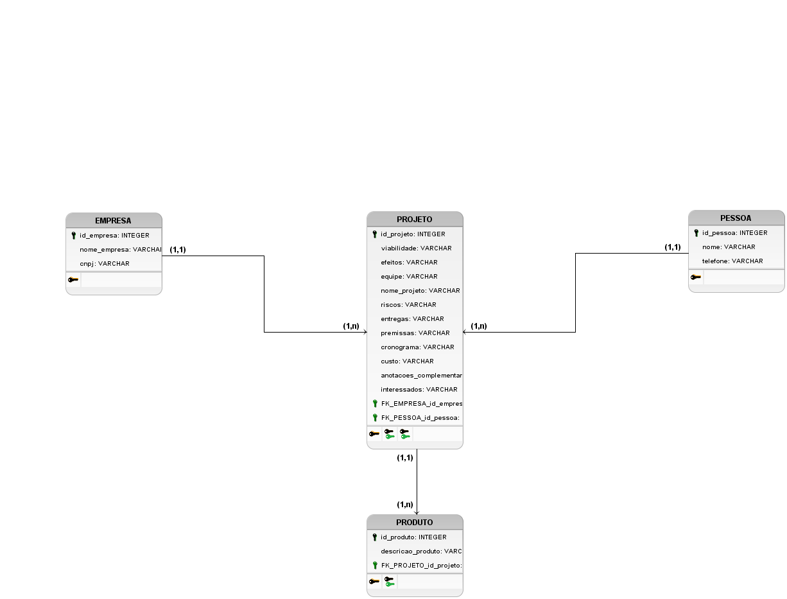

### Descrição: 
Criação de um sistema para prospecção de projetos no Polo de Inovação do IFES Campus Vitória.    

<b style="font-size: 20px;">[Mockup do projeto](arquivos/Mockup_Prospeccao_Projetos.pdf)</b>   

### Modelo conceitual: 
   

### Modelo lógico: 
   

Pasta do Google Drive:

https://drive.google.com/drive/folders/1CVqCn_gGK5CP8oXlqElxSrczc94dWwYH   

Joomla

Portal referência: 

http://portalpadrao.joomlacalango.org 
 
Repositório:

https://github.com/joomlagovbr
 
Documentação:

https://github.com/joomlagovbr/documentacao
